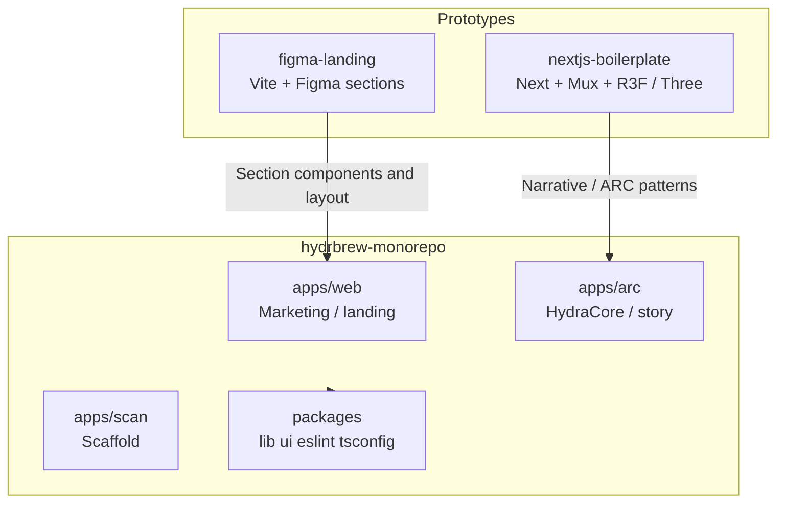

# Technical challenges and solutions (HydrBrew)

This document is a **study reference** in two parts:

- **Part 0** explains how the work fits together **from early prototypes** through **Figma → Vite → merge into a Turborepo** and the **Figma/landing → Next.js (`apps/web`)** port, including how sibling folders in the **parent workspace** relate to the monorepo.
- **Part I (§1–16)** is the **detailed monorepo technical reference**: Klaviyo, TypeScript, Tailwind v4, App Router, motion, ARC, and quick-reference tables.

For each area it states the **problem**, the **approach taken in code**, **implementation details** (data shapes, environment variables, file paths), and **tradeoffs or pitfalls** when you extend the system. Part 0 is derived from the **current layout of the whole workspace** (not only `hydrbrew-monorepo/`) and from comparing `figma-landing` to `apps/web`. Part I stays anchored to the monorepo.

---

## Table of contents

**Part 0 — End-to-end project journey**

- [0.1 Workspace map (three top-level codebases)](#01-workspace-map-three-top-level-codebases)
- [0.2 Early ARC / HydraCore prototype: `nextjs-boilerplate`](#02-early-arc--hydracore-prototype-nextjs-boilerplate)
- [0.3 Figma → Vite: `figma-landing` (design handoff)](#03-figma--vite-figma-landing-design-handoff)
- [0.4 Merge into the monorepo: `hydrbrew-monorepo`](#04-merge-into-the-monorepo-hydrbrew-monorepo)
- [0.5 Figma → Next: porting the landing to `apps/web`](#05-figma--next-porting-the-landing-to-appsweb)
- [0.6 After merge: product wiring, copy, and iteration](#06-after-merge-product-wiring-copy-and-iteration)
- [0.7 What each folder is for (today)](#07-what-each-folder-is-for-today)

**Part I — Monorepo technical deep dives (§1–16)**

1. [Monorepo: multiple apps, one toolchain](#1-monorepo-multiple-apps-one-toolchain)
2. [Shared TypeScript across Next.js apps and `@repo/lib`](#2-shared-typescript-across-nextjs-apps-and-repolib)
3. [Klaviyo: secure subscription without exposing private keys](#3-klaviyo-secure-subscription-without-exposing-private-keys)
4. [Klaviyo: multiple lists and per-request list selection](#4-klaviyo-multiple-lists-and-per-request-list-selection)
5. [Klaviyo: upstream failures, non-JSON responses, and the client “envelope”](#5-klaviyo-upstream-failures-non-json-responses-and-the-client-envelope)
6. [Marketing forms: many entry points, one pattern](#6-marketing-forms-many-entry-points-one-pattern)
7. [Toasts and analytics without tight vendor coupling](#7-toasts-and-analytics-without-tight-vendor-coupling)
8. [Next.js App Router: where “use client” lives and why](#8-nextjs-app-router-where-use-client-lives-and-why)
9. [SEO and document-level styling](#9-seo-and-document-level-styling)
10. [Tailwind CSS v4, content scanning, and global chrome](#10-tailwind-css-v4-content-scanning-and-global-chrome)
11. [Layout overflow, horizontal scroll, and `next/image` remote hosts](#11-layout-overflow-horizontal-scroll-and-nextimage-remote-hosts)
12. [Motion, scroll-driven UI, and layered z-index](#12-motion-scroll-driven-ui-and-layered-z-index)
13. [Feature flags: pre-launch marketing vs. future commerce](#13-feature-flags-pre-launch-marketing-vs-future-commerce)
14. [ARC: media-heavy, data-colocated experience](#14-arc-media-heavy-data-colocated-experience)
15. [Reference: environment variables (conceptual map)](#15-reference-environment-variables-conceptual-map)
16. [Reference: file map](#16-reference-file-map)

---

## Part 0 — End-to-end project journey

### 0.1 Workspace map (three top-level codebases)

**Challenge:** the physical folder `c:\work\Hydrbrew\` (or equivalent) is **not** only the monorepo. The marketing landing exists in more than one form over time, so it is easy to edit the “wrong” copy or re-introduce old patterns (for example, **direct** Klaviyo calls from the browser with keys in the URL).

**Reality in the tree:** at the workspace root, three important directories coexist:

| Folder | Runtime / stack (from `package.json`) | Role |
| --- | --- | --- |
| `nextjs-boilerplate/` | Next.js, Tailwind 4, **Mux** video, **React Three Fiber** + **Three.js** | Long-lived **single-app** HydraCore / “ARC”-style experience (narrative UI, 3D, video). |
| `figma-landing/` | **Vite** + **React 18**, Tailwind 4, huge **Radix / shadcn-style** `ui/*` | **Figma (Make) → code** handoff: one-page marketing composition with the same **section names** as production (hero, product, manifesto, etc.). |
| `hydrbrew-monorepo/` | **pnpm** + **Turborepo**, **Next 16** `apps/web` & `apps/arc`, shared `packages/*` | **Current integration point**: multiple apps, shared config, and the **shipped** public landing in `apps/web`. |

**Solution (mental model):** treat the monorepo as the **source of deployable truth** for the product; use the other two as **provenance** (where an experience or layout started) and for **regression checks** (visual or structural diff vs. `figma-landing`).



---

### 0.2 Early ARC / HydraCore prototype: `nextjs-boilerplate`

**Challenge:** you need a **highly interactive, media-heavy** “HydraCore” experience: long scroll, modals, video, possibly 3D, and many pieces of state (terminal, passcode, quadrants) **without** splitting the product across several repositories prematurely.

**What the code does:**

- A **single Next app** (see `package.json` name `nextjs`) with a **very large** `app/page.tsx` marked `use client` (typical of rapid iteration: one file holds UI state, lore, and layout comments).
- **Stack signals:** `@mux/mux-player-react` for video, `@react-three/fiber`, `@react-three/drei`, `three` for 3D, `lucide-react`, **Tailwind 4** (PostCSS path consistent with the rest of the project).
- **Implication for bundle and CPU:** 3D + video + a huge client page is **expensive**; this is an acceptable tradeoff for a flagship narrative demo, not necessarily for a minimal landing.

**Notable technical challenges in this shape of app:**

- **State sprawl** — many `useState` / `useEffect` in one file makes refactors error-prone; the monorepo’s `arc` app keeps the same *kind* of content (colocated data + media) but is isolated as **its own app** so the marketing `web` app stays independent.
- **Build surface** — `next build` must resolve three.js, Mux, etc.; keeping ARC out of the marketing app avoids coupling marketing deploys to 3D dependencies.

**Relation to the monorepo:** `apps/arc` is the place where that narrative experience **continued** after the monorepo was introduced (content and media URLs in `apps/arc/app/page.tsx`, similar in spirit to the boilerplate page).

---

### 0.3 Figma → Vite: `figma-landing` (design handoff)

**Challenge:** design tools (including **Figma Make**-style exports) often emit a **Vite + React** tree with a **full component library** (dozens of Radix/shadcn primitives) even if the actual page only needs a subset. You still need a **composable** one-page story that matches design pixel intent and motion.

**What the code does:**

- **Entry:** `figma-landing/src/app/App.tsx` **composes the marketing page** from section components: `HeroBifurcation`, `ProductShowcase`, `ProtocolSection`, `ManifestoSection`, `VideoShowcase`, `Footer`, etc.—the same **naming and rough section order** as `apps/web/components/landing/LandingPage.tsx`.
- **Dependencies:** a **large** set of **Radix UI** packages, **MUI icons**, `motion`, `lucide-react`, **Vite 6** with `@tailwindcss/vite`, etc. (see `figma-landing/package.json`). There is a full `src/app/components/ui/*` (buttons, dialog, form, table, …) as typically generated for a design system.
- **Klaviyo (important diff vs. monorepo):** in the Figma export, `EmailCaptureForm` performed a **direct** `fetch` to `https://a.klaviyo.com/api/v2/list/.../subscribe?api_key=...` with the **key in the query string** and a **hardcoded** list id. That works for a quick design prototype but is **poor for production**: keys in URLs appear in **logs and Referer** chains, and you cannot move to stricter private-API flows without a server.

**Challenges and solutions in this phase:**

| Challenge | How `figma-landing` addresses it | Limitation addressed later in the monorepo |
| --- | --- | --- |
| Fast visual iteration | Vite HMR, single `App` composition | Production needs **Next** routing, `metadata`, and deployment to Vercel or similar. |
| Design-system completeness | Check in full `ui/*` for composability | Most primitives are **unused** by the one-page `App`; shipping all of it in `web` would bloat the bundle. |
| Email capture | v2 public subscribe in the browser | Replaced in monorepo with **BFF** + `KLAVIYO_PRIVATE_KEY` and `@repo/lib/klaviyo` (Part I, §3–5). |

---

### 0.4 Merge into the monorepo: `hydrbrew-monorepo`

**Challenge:** you need **one** place to run **lint, typecheck, and build** for multiple surfaces (public marketing, ARC, future scan) and to **share** tokens (brand, SEO defaults, API helpers) without copy-paste.

**Solution (structure):**

- **Turborepo** at the monorepo root: `turbo run build|dev|lint|check-types` with task dependencies in `turbo.json`.
- **pnpm** workspaces: `apps/*` and `packages/*` in `pnpm-workspace.yaml`.
- **Apps:** `web` (port **3000** in dev), `arc` (port **3002**), `scan` (scaffold, port **3005** in `devAppOrigins` in `site-config.ts`).
- **Shared packages:** `@repo/lib` (e.g. `site-config`, `klaviyo`), `@repo/ui`, shared ESLint and TypeScript configs.

**Challenges and solutions in the merge itself:**

| Challenge | Solution in repo |
| --- | --- |
| Duplicate config (three ESLints, three tsconfigs) | One `@repo/eslint-config` + `@repo/typescript-config` extended by each app. |
| “Which app is running?” | Fixed ports in scripts and documented in `devAppOrigins` for cross-linking and mental clarity. |
| Library consumption without a publish step | `@repo/lib` is imported as **source** via workspace `exports` (Part I, §1–2). |
| Stale builds after env changes | Turbo `build` `inputs` include `.env*` so cache invalidates when environment changes. |

**ARC in the monorepo:** the narrative app from the boilerplate line of work is **isolated** under `apps/arc` so it can ship on its own route/project while sharing repo-wide standards.

**Marketing in the monorepo:** a dedicated **`apps/web`** app becomes the home of the **Figma-structured landing** (next section) instead of the Vite `App.tsx`.

---

### 0.5 Figma → Next: porting the landing to `apps/web`

**Challenge:** move from **Vite SPA** to **Next.js App Router** while preserving **layout, motion, and section identity**, and add **production** concerns: SEO, server boundaries, `next.config.js` images, and **no secrets in the client** for email capture.

**What was ported (structural):**

- **Component parity:** the live landing lives under `apps/web/components/landing/`, with the same **conceptual** components as `figma-landing/src/app/components/` (e.g. `HeroBifurcation`, `VideoShowcase`, `ManifestoSection`, `figma/ImageWithFallback.tsx` in both trees).
- **Composition root:** Figma’s `App.tsx` maps to `LandingPage` + a thin `app/page.tsx` server entry that only renders `LandingPage` (Part I, §8).
- **Styling stack:** both use **Tailwind 4** and **motion** (`motion/react`); the **integration** differs (Vite uses `@tailwindcss/vite`; Next uses `@tailwindcss/postcss` and `@source` in `globals.css`—Part I, §10).

**Deliberate differences (not 1:1 copies):**

| Area | `figma-landing` | `apps/web` |
| --- | --- | --- |
| Router | Vite `App` is the whole page | Next **App Router**; `metadata` in `layout.tsx` |
| UI kit | Large `ui/*` Radix set available | **Not** all primitives copied—production uses what sections need + `lucide-react` to limit bundle size |
| Email | Direct Klaviyo v2 URL in `fetch` | `@repo/lib/klaviyo` + `POST` to `/api/klaviyo/subscribe` (private key on server) |
| UX overlay | (varies by export) | `SignupToast` + `hydrbrew:toast` + `signupFlow` analytics (Part I, §6–7) |
| Section order / ids | e.g. `TwoWaysToPlay` with `id="two-ways-to-play"`, `LiquidWaveDivider` in imports | `LandingPage` may **reorder** sections, use `DualWaveDivider`, add `SignupToast`, skip or relocate some Figma sections when consolidating |

**Challenges and solutions in the port:**

1. **Client vs server components** — almost the entire landing is **client** (`"use client"` on `LandingPage`); the **document shell** and **metadata** stay server-side (Part I, §8–9).
2. **Tailwind class discovery** — Next places components under `components/`, so `globals.css` must **`@source` those files** or styles silently disappear in production (Part I, §10).
3. **`next/image` allowlist** — Figma may use arbitrary image hosts; Next requires **`images.remotePatterns`** in `next.config.js` (Part I, §11).
4. **Horizontal overflow** — full-bleed sections: root `overflow-x-hidden` on the page and body styles (Part I, §10–11).

---

### 0.6 After merge: product wiring, copy, and iteration

**Challenge:** after the page exists in `apps/web`, the work shifts from “port the layout” to “make it a **funnel**”: every important form submits to the **right** list, **tracked** for analytics, and **copy** matches brand.

**What the monorepo implementation emphasizes (independent of any version-control story):**

- **Unify main waitlist signups** — multiple surfaces (e.g. hero, final CTA, floating nav, and related forms) all use **`subscribeToMainKlaviyoList`** and consistent **`signup_source`** strings so CRM and GA-like tools stay interpretable (Part I, §6).
- **Secondary list** (Oura / manifesto path) — **`subscribeToOuraKlaviyoList`** and a separate list id in env, without duplicating server logic (Part I, §4).
- **Copy and narrative polish** — headlines (e.g. “HYDRCORE” / mission-intel art direction) and section text are **product passes** on top of the structural port; they live in the same section components and can be revisited without changing architecture.

**Why this is listed as its own “phase”:** the **technical** pattern (components + `@repo/lib`) is stable, but **CRM and analytics** requirements evolve with campaigns—treat this as **ongoing** work in the same files.

---

### 0.7 What each folder is for (today)

| Path | When to use it | When *not* to use it |
| --- | --- | --- |
| `hydrbrew-monorepo/apps/web` | **Production** public marketing / pre-launch site; the only place that should have **Vercel** (or your host) **env** for Klaviyo BFF, etc. | N/A (primary) |
| `hydrbrew-monorepo/apps/arc` | **HydraCore** narrative, heavy media, story data | If you only need a **lightweight** marketing tweak—use `web`. |
| `hydrbrew-monorepo/packages/lib` | Shared **constants**, Klaviyo helpers, anything both apps need | Not for app-specific large assets or ARC-only copy |
| `figma-landing` | **Regenerate or compare** when design updates in Figma; **prototype** a section in isolation in Vite | **Do not** treat as prod unless you plan a deliberate Vite deploy; Next is the delivery vehicle for the main site. |
| `nextjs-boilerplate` | **Reference** for the original single-file Next + 3D + Mux **ARC**-style app; may diverge from `apps/arc` over time | **Do not** duplicate major features here and in `apps/arc` without reconciling, or you will fix bugs twice. |

---

## Part I — Monorepo technical deep dives

## 1. Monorepo: multiple apps, one toolchain

### Problem

You need a **public marketing site** (`web`), a **separate long-scroll / story experience** (`arc`), and a **placeholder for a future app** (`scan`), without copying ESLint, TypeScript presets, and formatting rules three times, and while keeping local development predictable.

### Solution (in this repo)

- **pnpm workspaces** over `apps/*` and `packages/*` (see `pnpm-workspace.yaml`).
- **Turborepo** orchestrates `build`, `lint`, `check-types`, and `dev` with a shared graph (`turbo.json`).
- **Shared packages:** `@repo/ui`, `@repo/lib`, `@repo/eslint-config`, `@repo/typescript-config`.

### Implementation details

| Mechanism | Purpose |
| --- | --- |
| `"dependsOn": ["^build"]` on the `build` task | Build dependencies before dependents so workspace packages that emit artifacts (or that apps depend on) run in order. |
| `build` `inputs` include `.env*` | Changing environment variables can invalidate the Turbo cache for builds—important when debugging “stale” production builds after env updates. |
| `check-types` depends on `^check-types` and `build` | Typechecking can assume generated or dependency outputs exist (notably `next` typegen under `web`). |
| `dev` has `"cache": false, "persistent": true` | Long-running dev servers are never cached; Turbo treats them as ongoing processes. |
| `packageManager: "pnpm@9.0.0"` + `engines.node >= 18` | Reproducible installs and a documented Node floor. |

### Tradeoffs and pitfalls

- **Running the wrong app:** each app’s `dev` script pins a **port** (e.g. `web` uses `--port 3000`). Sibling app URLs for local work are listed in `packages/lib/src/site-config.ts` under `devAppOrigins`. If you later add cross-app links or iframes, you need consistent origins.
- **Filter when debugging:** `turbo run build --filter=web` (or the equivalent) avoids building the world when you only care about one app.

---

## 2. Shared TypeScript across Next.js apps and `@repo/lib`

### Problem

Next.js 16+ apps use **bundler** module resolution and **Next’s TypeScript plugin**, while internal libraries often want **strict** base settings. You still need `@repo/lib` imports to resolve and typecheck everywhere.

### Solution

- **Layered `tsconfig`:** `packages/typescript-config/base.json` enforces `strict: true`, `isolatedModules: true`, `noUncheckedIndexedAccess: true` (indexed access can be `undefined`), `moduleResolution: "NodeNext"` for packages that use NodeNext-style resolution.
- **App-specific preset:** `packages/typescript-config/nextjs.json` **extends** `base.json` but overrides to `"module": "ESNext"`, `"moduleResolution": "Bundler"`, `jsx: "preserve"`, `noEmit: true`—matching Next’s expectations.
- **`apps/web/tsconfig.json`** extends the Next preset and **includes** `next.config.js` and `.next/types/**/*.ts` so route types and `next` plugin output participate in checking.
- **`@repo/lib` exports** use a **wildcard map**: `"./\*": "./src/*.ts"` in `packages/lib/package.json`, so `import { x } from '@repo/lib/klaviyo'` resolves to `src/klaviyo.ts` without a separate build step that publishes `dist/`.

### Implementation detail: `@repo/lib` “build”

`@repo/lib`’s `build` script is effectively a no-op (`node -e "process.exit(0)"`). The library is consumed as **TypeScript source** through the workspace; the Next app (or tsc in `check-types`) compiles it. The package still runs `tsc --noEmit` under `check-types` for early error detection.

### Tradeoffs and pitfalls

- **`noUncheckedIndexedAccess`:** code that assumes `arr[i]` is always defined may need `!` or guards—this is intentional strictness.
- **Mixing `window` and `process.env` in `@repo/lib`:** e.g. `klaviyo.ts` checks `typeof process !== "undefined"` before reading `process.env` so the same file can be imported in environments where `process` is missing or partial.

---

## 3. Klaviyo: secure subscription without exposing private keys

### Problem

Klaviyo’s **REST** APIs for reliable server-side list updates typically use a **private API key**. You must **never** send that key to the browser. At the same time, marketing forms run **in the client** and need a simple `fetch` to subscribe.

**Additional complexity:** Klaviyo has evolved **multiple API families** (e.g. older v2 list subscribe with a **public** site key vs. newer **Profiles**-oriented flows with a private key and `revision` headers). The repo intentionally supports a **BFF (Backend-for-Frontend)** pattern on Next.

### Solution

1. **Route handler:** `POST /api/klaviyo/subscribe` in `apps/web/app/api/klaviyo/subscribe/route.ts`  
   - Reads `KLAVIYO_PRIVATE_KEY` **only** on the server.  
   - Calls Klaviyo’s `profile-subscription-bulk-create-jobs` endpoint with `Authorization: Klaviyo-API-Key …` and a configurable `revision` header (default `2026-04-15`, overridable via `KLAVIYO_API_REVISION`).  
   - Uses `cache: "no-store"` on the outbound `fetch` so subscriptions are not cached by Next’s data cache.

2. **Client library:** `packages/lib/src/klaviyo.ts`  
   - In the **browser** (`typeof window !== "undefined"`), `subscribeToKlaviyoList` **does not** call Klaviyo directly with the private key. It `POST`s to **same-origin** `/api/klaviyo/subscribe` (optionally with `?listId=...`).  
   - On the **server** (no `window`), the same function can call the **v2** `https://a.klaviyo.com/api/v2/list/.../subscribe?api_key=...` path—appropriate when a non-browser caller uses the public key (documented in file comments). That path is not used from the marketing components for secret-bearing flows.

### Request body contract (client → BFF)

The handler expects JSON:

```json
{ "profiles": [ { "email": "user@example.com", … } ] }
```

The handler **rejects** empty arrays, non-arrays, or profiles that do not have a string `email` after normalization. That prevents accidental “success” on malformed payloads.

### Tradeoffs and pitfalls

- **Defaults in `@repo/lib`:** `klaviyo.ts` contains **default** public key and list IDs as fallbacks when env vars are unset. This helps local dev but means **sensible keys in production should always be set explicitly** so you do not rely on committed defaults in client bundles.
- **CORS is not the issue** for the browser path: the browser talks to **your** Next origin; only the server talks to Klaviyo. Keep it that way for any new provider.

---

## 4. Klaviyo: multiple lists and per-request list selection

### Problem

The product needs **at least two audiences**: a **primary waitlist** and a **secondary list** (e.g. “Oura” / manifesto track), each possibly a different Klaviyo list ID. Forms should not hardcode list IDs in every component.

### Solution

- **Main list:** `subscribeToMainKlaviyoList` → `subscribeToKlaviyoList(profile)` with **no** `listId` argument. In the browser, the request goes to `/api/klaviyo/subscribe` without a query string; the route resolves the list from `KLAVIYO_LIST_ID` or `NEXT_PUBLIC_KLAVIYO_LIST_ID` (in that order, after an optional `listId` query—see next bullet).

- **Secondary (Oura) list:** `subscribeToOuraKlaviyoList` reads `NEXT_PUBLIC_KLAVIYO_OURA_LIST_ID` (with a code default) and calls `subscribeToKlaviyoList(profile, ouraListId)`. In the browser, that becomes `/api/klaviyo/subscribe?listId=...`, so the **same** route handler serves both flows.

### Resolution order on the server (`getConfiguredListId`)

1. `?listId=` from the request URL, if non-empty.  
2. `process.env.KLAVIYO_LIST_ID`  
3. `process.env.NEXT_PUBLIC_KLAVIYO_LIST_ID`  

This lets you **override** the list for testing or special campaigns without redeploying, while production can rely on server-only `KLAVIYO_LIST_ID`.

### Tradeoffs and pitfalls

- **Public `NEXT_PUBLIC_*` for list IDs:** any list ID exposed with `NEXT_PUBLIC_` is visible in the client bundle. That is **acceptable** for list identifiers (not the private key) but is a design choice: do not put secrets in `NEXT_PUBLIC_`.
- **Consistency across forms:** multiple components (`EmailCaptureForm`, `FloatingNav`, `ManifestoSection`, etc.) must use the same helpers so each form targets the **intended** list; if you add a new form, follow the same imports.

---

## 5. Klaviyo: upstream failures, non-JSON responses, and the client “envelope”

### Problem

Network calls to SaaS APIs fail in several ways: **4xx/5xx**, **empty bodies**, **HTML error pages**, **timeouts**, or **valid JSON** with error semantics. The UI must not crash, and the client library must return a **predictable** result type.

### Solution (BFF)

In `route.ts`:

- If `response.json()` fails, it **falls back** to reading **text** and returns a structured error object with `statusText` and optional `body` snippet.
- On network failure to Klaviyo, returns **502** with `{ ok: false, error: "Unable to reach Klaviyo upstream" }`.
- For successful HTTP status, returns Klaviyo’s JSON (or a small placeholder message) in `data`; for failure, `data` is `undefined` and `error` carries payload.

The HTTP status code returned to the browser **mirrors** Klaviyo’s status when the upstream was reached (`status: klaviyoResponse.status` in the JSON `NextResponse`).

### Solution (client library)

`subscribeToKlaviyoList` always parses JSON **safely** (`parseJsonSafely`). It then:

- If the parsed value looks like an **envelope** (`{ ok: boolean, data?, error? }`), it maps that to `KlaviyoSubscribeResult`.  
- Else, if `response.ok`, it treats the call as success.  
- Else, returns `{ ok: false, error: parsed }`.

This lets the BFF and any future route return the same **envelope** shape, which the forms already use via `if (result.ok)`.

### Tradeoffs and pitfalls

- **Double `await` bug avoided:** the route is careful not to read the response body twice in a way that throws; the flow tries JSON first, then text.
- **User-facing copy:** form components map `result.ok` to success toasts and `catch` to network error toasts—keep messages aligned with the envelope contract if you add new API routes.

---

## 6. Marketing forms: many entry points, one pattern

### Problem

The landing page has **multiple** CTAs: hero, final section, floating nav, video section, etc. Each needs:

- A stable **`signup_source`** (or similar) for CRM segmentation.
- The same **success** path: optional scroll to the next story section, thank-you state, and analytics.
- The same **failure** path: toast + failure analytics.

### Solution

- **Shared Klaviyo calls:** all major forms import `subscribeToMainKlaviyoList` or `subscribeToOuraKlaviyoList` from `@repo/lib/klaviyo`, not ad hoc URLs.
- **Shared UX helpers** in `signupFlow.ts`:  
  - `trackSignupEvent('waitlist_join_success' | 'waitlist_join_failed', { source, status?, emailDomain?, reason? })`  
  - `showSignupToast({ variant, message })`  
  - `getEmailDomain(email)` for **privacy-tilted** analytics (domain only, not full address)  
  - `scrollToSection(id)` for post-signup flow

- **Per-form `signup_source`:** e.g. `EmailCaptureForm` uses a map from `variant` (`hero` | `final` | `referral`); `FloatingNav` uses `'floating_nav'`. The manifesto flow uses `subscribeToOuraKlaviyoList` with `signup_source: 'oura_beta_form'`.

### Example: `FloatingNav` scroll threshold

`FloatingNav` shows after `scrollY > 0.8 * innerHeight`, keeping the first screen uncluttered. After a successful submit, it calls `scrollToSection('manifesto')` to move the user into the next narrative block—**behavior encoded once** in that component, not in global routing.

### Tradeoffs and pitfalls

- **Duplicated try/catch/finally** across components: intentional **simplicity** (each form is self-contained). A future refactor could extract a `useWaitlistSubmit` hook if you need to reduce repetition—watch for `signup_source` and scroll targets diverging.
- **`EmailCaptureForm` pulse UI:** `remainingCount` drives animation speed (`pulseDuration`), tying visual urgency to a marketing prop. If the count is dynamic from an API later, ensure it does not re-render the form in a way that **resets** React state unexpectedly.

---

## 7. Toasts and analytics without tight vendor coupling

### Problem

You want **inline feedback** (toasts) and **conversion events** (GA, GTM, or future tools) without importing `gtag` in every form or hardcoding a single analytics provider.

### Solution: small event bus on `window`

`signupFlow.ts` dispatches:

- `hydrbrew:waitlist` with detail `{ event, source, status?, … }`
- `hydrbrew:toast` with `{ variant, message }`

Additionally, it pushes to `window.dataLayer` when that array exists, and calls `window.gtag` when defined—**optional** integrations.

`SignupToast.tsx` (mounted once in `LandingPage`) subscribes to `hydrbrew:toast` in a `useEffect`, validates `variant`, and auto-dismisses after **3200ms**. It uses `motion/react` and `AnimatePresence` for entry/exit.

### Tradeoffs and pitfalls

- **Global events:** any script on the page can `dispatchEvent` or listen—treat as **same-origin only**; do not put secrets in event detail.
- **Listener cleanup:** the toast component registers `addEventListener` and removes it on unmount—follow the same pattern for new global listeners to avoid memory leaks in SPAs.
- **Testing:** headless tests may not have `dataLayer` or `gtag`; the `trackSignupEvent` guard clauses handle that (no throw).

---

## 8. Next.js App Router: where `use client` lives and why

### Problem

The App Router **defaults to Server Components**. A page full of `useState`, `useEffect`, `motion`, and browser APIs **cannot** be a server component.

### Solution

- **`app/page.tsx`:** thin server **default** component that only renders `LandingPage`. No `"use client"` here—keeps the route entry as small as possible.
- **`LandingPage`:** file starts with `"use client"` and imports the entire section tree. All interactive children are bundled as client components transitively.

### Tradeoffs and pitfalls

- **Bundle size:** the whole landing is **one client tree**. If the site grows, you may split **below-the-fold** sections into separate client chunks via `dynamic(() => import(...), { ssr: false / loading })` *only if* you measure a real need; premature splitting can complicate layout.
- **Metadata:** document-level `<title>` and **description** stay in `app/layout.tsx` using `siteMetadata` from `@repo/lib/site-config`—so SEO does not depend on the client tree.

---

## 9. SEO and document-level styling

### Problem

A black, immersive landing must still be **crawlable** and have **readable** default typography; fonts should **not** flash wildly on load.

### Solution

- **`layout.tsx`** uses `next/font/google` for **Inter** (body) and **JetBrains Mono** as a CSS variable (`--font-mono`) for mono UI. `display: "swap"` reduces invisible text duration.
- **`metadata` export** pulls `title` and `description` from `siteMetadata` in `@repo/lib` so copy is centralized.

### Tradeoffs and pitfalls

- If you add **og:image** or **structured data**, extend `metadata` in `layout.tsx` (or per-route) rather than only in client components, so scrapers that do not run JS still see the tags.

---

## 10. Tailwind CSS v4, content scanning, and global chrome

### Problem

Tailwind v4 changes how you integrate with PostCSS and how **class scanning** finds source files. A monorepo app also has components **outside** `app/` in `components/`.

### Solution (in this repo)

- **PostCSS:** `postcss.config.mjs` only enables `@tailwindcss/postcss` (no legacy `tailwind.config` file required in the v4 style used here; design tokens and `@source` live in CSS).
- **`app/globals.css`:**  
  - `@import "tailwindcss";`  
  - `@source "../components/**/*.{js,ts,jsx,tsx}";` so classes used only under `components/landing` are not tree-shaken away by the scanner.  
  - `html { scroll-behavior: smooth; }` supports in-page `scrollToSection` / hash navigation.  
- **Custom scrollbar** styling uses `::-webkit-scrollbar` and `scrollbar-color` (Firefox) with **CSS variables** for a brand-aligned cyan “protocol” look.

### Tradeoffs and pitfalls

- If you move components to a **new folder**, update `@source` (or add a new `@source` line) or utility classes in those files will **not** generate—symptoms: **missing styles in dev/prod** with no TypeScript error.
- **Global** `max-width: 100vw` + `overflow-x: hidden` on `body` fights accidental horizontal layout overflow from `100vw` or wide child elements; if something still overflows, use DevTools to find the offending element width.

---

## 11. Layout overflow, horizontal scroll, and `next/image` remote hosts

### Problem

- Immersive sections often use **full-bleed** backgrounds, negative margins, and wide tickers. A single mis-sized child can cause **horizontal scroll** on mobile.
- Using `next/image` for **remote** URLs requires **explicit** host allowlists in **Next 16** security defaults.

### Solution

- **Outer shell:** `LandingPage` root uses `overflow-x-hidden` and `min-h-screen` to cap horizontal scroll at the page boundary where possible, **in addition to** the global `body` rules in `globals.css`.
- **`next.config.js`:** `images.remotePatterns` whitelists hosts such as `i.imgur.com`, `images.unsplash.com`, `stream.mux.com`, and `image.mux.com`. **Any new CDN** used with `next/image` must be added there or the build/runtime will reject the URL.

### Tradeoffs and pitfalls

- Components that use **plain ``** or `backgroundImage: url(...)` (see `VideoShowcase`) do **not** go through `next/image` optimization. That avoids config for ad-hoc URLs but loses automatic resizing and `srcset`. For performance work later, migrate hot images to `next/image` and extend `remotePatterns` accordingly.
- **Imgur and mix-blend** layers (e.g. in `VideoShowcase`) can affect **contrast and readability**; the section stacks **gradient overlays** to restore text legibility—when changing art, re-check mobile contrast.

---

## 12. Motion, scroll-driven UI, and layered z-index

### Problem

- Heavy animation libraries can hurt **LCP** and **main thread** if everything animates on load.
- Overlays (nav, toasts, modals) need a **clear stacking order** so clicks and focus work.

### Solution

- **Libraries:** the project uses **`motion/react`** (the Motion One evolution path) with hooks like `useInView` so sections can **defer** `animate` until scrolled into view (`once: true` with a negative margin in some sections for earlier trigger).
- **Example:** `VideoShowcase` uses `useInView` for the header block while using separate `useState`/`useEffect` for a “slot machine” number animation—separating **scroll reveal** from **time-based** loops.
- **Z-index map (examples from code):**  
  - `FloatingNav` fixed bar: `z-50`  
  - `SignupToast` container: `z-[70]` (above nav)  
  - `VRPortalModal` backdrop: `z-[9999]` (top layer for modals)  

### Tradeoffs and pitfalls

- **Timers in `useEffect`:** `VideoShowcase` sets nested `setInterval`/`setTimeout` chains; the cleanup on unmount **must** clear all timers to avoid **state updates on unmounted components** and memory churn. If you add more animated sections, follow strict cleanup patterns.
- **Modal focus:** `VRPortalModal` handles **Escape** to close. For accessibility, a future pass could add **focus trap** and `aria-modal` / `role="dialog"`.

---

## 13. Feature flags: pre-launch marketing vs. future commerce

### Problem

The same `web` app is expected to move from a **pre-launch** marketing experience to a phase where **headless Shopify** (or similar) sections appear on the same routes, without a full rewrite.

### Solution (current state)

`siteConfig.launchMode` in `packages/lib/src/site-config.ts` is **`false`**, with a comment that commerce is not integrated yet and this flag is the place to **flip** when storefront sections should appear.

No storefront code paths are wired in the snippet you read; the flag is **architectural preparation**.

### Tradeoffs and pitfalls

When you implement commerce:

- You will likely need **server-only** API routes or React Server Components for **cart and checkout** tokens—do not expose secrets in `NEXT_PUBLIC_`.
- Consider **splitting** “marketing” and “store” layouts at the `layout.tsx` or segment level once `launchMode` branches real behavior, to keep bundle size down for first-time visitors.

---

## 14. ARC: media-heavy, data-colocated experience

### Problem

`apps/arc` delivers a **narrative** UI with long video URLs, many images, and character/story data. Central questions: where does content live, and how do you keep **TTFB** and **client JS** under control?

### Current approach in code

- **Data colocated** in a very large `app/page.tsx` as **plain objects/arrays** (e.g. `stories: Record<StoryId, StoryEntry>`) with **remote** media URLs (Vercel Blob, image hosts) rather than bundling large binaries in git.
- **No special `next.config` tuning** in `arc` yet (empty `nextConfig` object)—future optimizations would go here (headers, rewrites, `images` domains, `experimental` flags as needed).

### Tradeoffs and pitfalls

- **Maintainability:** editing copy or URLs requires **developer** changes. A CMS, MDX, or headless data source becomes attractive when **non-devs** own content.
- **Type safety vs. size:** a single file can grow hard to review; splitting by `StoryId` into `stories/zenara.ts` etc. preserves types with clearer diffs.
- **Video autoplay and mobile OS policies:** if you add `<video>`, test **muted** autoplay, `playsInline`, and poster images on iOS Safari.

---

## 15. Reference: environment variables (conceptual map)

| Variable (examples from code) | Where used | Sensitivity |
| --- | --- | --- |
| `KLAVIYO_PRIVATE_KEY` | Server route only | **Secret** – never `NEXT_PUBLIC_` |
| `KLAVIYO_API_REVISION` | Server route, optional | Non-secret, but part of server contract |
| `KLAVIYO_LIST_ID` | Server list resolution | Prefer server-only; identifies a list, not a key |
| `NEXT_PUBLIC_KLAVIYO_LIST_ID` | Server fallback; also readable in client bundle | **Public** (list id) |
| `NEXT_PUBLIC_KLAVIYO_PUBLIC_KEY` | `@repo/lib` for v2 URL construction | **Public** (Klaviyo “site” / public key) |
| `NEXT_PUBLIC_KLAVIYO_OURA_LIST_ID` | Oura / secondary list id | **Public** (list id) |

Always re-read the actual route and `klaviyo.ts` when Klaviyo changes their API, **revision** dates, or consent requirements (GDPR, double opt-in).

---

## 16. Reference: file map

| Concern | Primary files |
| --- | --- |
| Turborepo pipeline | `hydrbrew-monorepo/turbo.json`, `hydrbrew-monorepo/package.json` |
| Workspace layout | `hydrbrew-monorepo/pnpm-workspace.yaml` |
| Site copy & flags | `hydrbrew-monorepo/packages/lib/src/site-config.ts` |
| Klaviyo (client) | `hydrbrew-monorepo/packages/lib/src/klaviyo.ts` |
| Klaviyo (BFF) | `hydrbrew-monorepo/apps/web/app/api/klaviyo/subscribe/route.ts` |
| Signup events & toasts | `hydrbrew-monorepo/apps/web/components/landing/signupFlow.ts` |
| Toast UI | `hydrbrew-monorepo/apps/web/components/landing/SignupToast.tsx` |
| Landing composition | `hydrbrew-monorepo/apps/web/components/landing/LandingPage.tsx` |
| Route entry + SEO shell | `hydrbrew-monorepo/apps/web/app/page.tsx`, `hydrbrew-monorepo/apps/web/app/layout.tsx` |
| Global CSS + Tailwind v4 + `@source` | `hydrbrew-monorepo/apps/web/app/globals.css` |
| Remote images | `hydrbrew-monorepo/apps/web/next.config.js` |
| Example heavy section | `hydrbrew-monorepo/apps/web/components/landing/VideoShowcase.tsx` |
| ARC story (monorepo) | `hydrbrew-monorepo/apps/arc/app/page.tsx` |
| Figma / Vite prototype (sibling) | `figma-landing/src/app/App.tsx`, `figma-landing/src/app/components/*` |
| Early Next + Mux + R3F prototype (sibling) | `nextjs-boilerplate/app/page.tsx` |

---

## How to maintain this document

- **Part 0:** when the **parent workspace** layout changes (e.g. you retire `figma-landing` or merge prototypes), update [§0.1–0.7](#01-workspace-map-three-top-level-codebases) and the [§0.7](#07-what-each-folder-is-for-today) table. When a **Figma re-export** lands, call out new **porting diffs** under [§0.5](#05-figma--next-porting-the-landing-to-appsweb).
- **Part I:** when you solve a new **monorepo** problem (performance, security, build, types), add or extend a numbered section: **Problem → Solution → Files → Tradeoffs.**
- Link to **Klaviyo / Next / Turborepo** in code comments; this file stays an **in-repo** map, not a replacement for vendor docs.

When you are unsure, **read the code paths in the file map** and verify against the tree: Part 0 is about **relationships between folders**; Part I is about **mechanics inside `hydrbrew-monorepo/`.**
